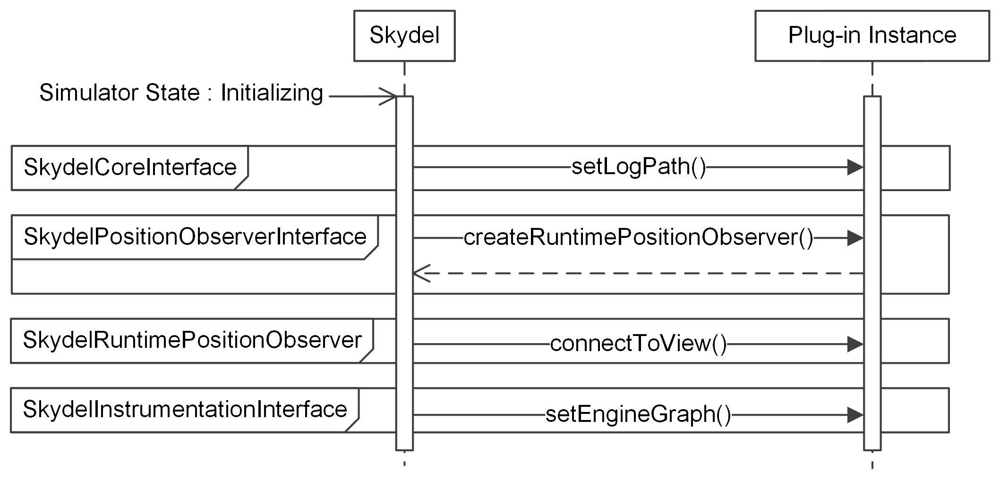
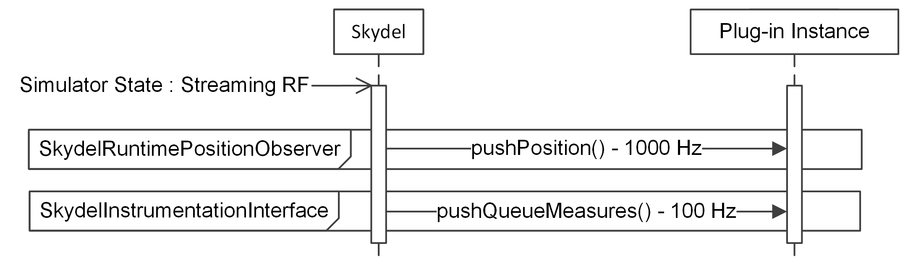

# Plug-in Instance at Runtime

### Instantiation Sequence

Instantiating a plug-in manually or via the loading of the configuration file is the same, except for the `setConfiguration` call that only occurs in the second case.

### Simulator State: Initializing

### Simulator State: Streaming RF

